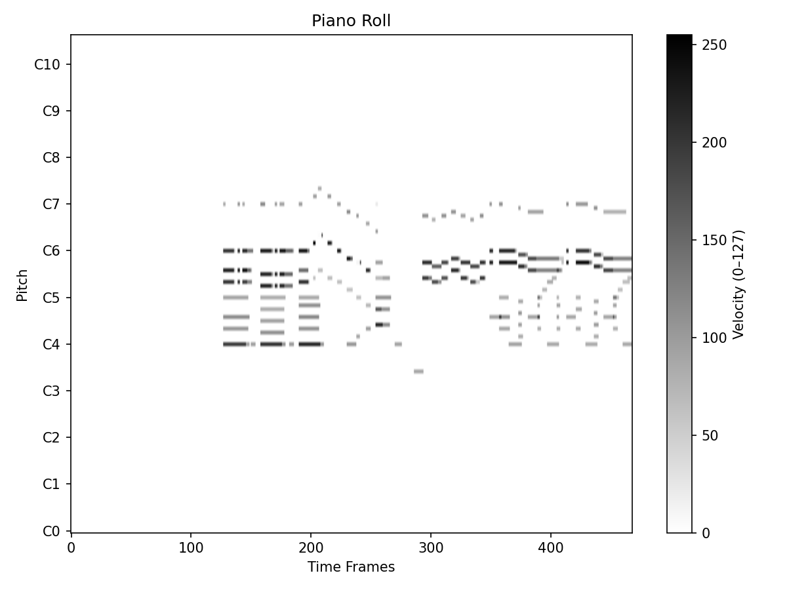
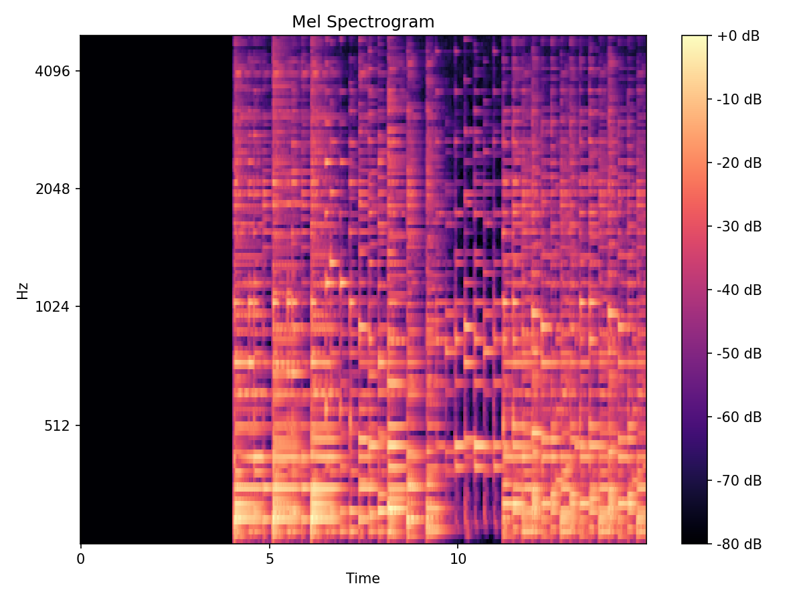

# VERSION 0.4
# DSAN 6600 Project — Music Information Retrieval

Deep learning on the [Lakh MIDI Dataset (LMD full)](https://colinraffel.com/projects/lmd/) (~174K MIDI files) to predict two musical attributes from a 15-second clip:

| Task | Target | Best Result |
| --- | --- | --- |
| **Classification** | Key signature (10 major keys) | ~80% test accuracy (CNN + BiGRU) |
| **Regression** | Initial BPM (tempo) | MAE = 11.00 bpm (CNN + biGRU) |

Training runs on **Google Colab** (NVIDIA H100 /A100 / L4).

---

## Quickstart

**Run the notebooks on Colab in this order:**

1. `scripts/data-processing/process_midi.ipynb` — build the metadata CSV
2. `scripts/data-processing/midi_to_spectrogram.ipynb` *(piano-roll path)* **or** `process_spects.ipynb` *(mel-spectrogram path)*
3. Any notebook in `scripts/models/` — e.g. `DSAN_6600_Piano_Class_CNN_GRU.ipynb`

Visual Example Piano-roll & Spectrogram 

<p align="center">
  
  
</p>

---

## Repository Layout

```
scripts/
  data-processing/
    process_midi.ipynb          # Parse LMD → lmd_full_metadata.csv
    midi_to_spectrogram.ipynb   # MIDI → piano-roll .npz + TruncatedSVD
    process_spects.ipynb        # MIDI → mel-spectrogram .npy
  models/                       # Training notebooks (see below)
  piano_spec_vis.py             # Standalone visualization script
data/
  processed_data/
    lmd_full_metadata.csv       # Only tracked data file (~155K rows)
outputs/                        # Example visualizations
references.bib                  # Report references
```

### Model Notebooks

Naming convention: `DSAN_6600_{Piano|Spect}_{Class|Regr}_{CNN|CNN_GRU}[_HP_Tuning].ipynb`

| Input | Task | Notebooks |
| --- | --- | --- |
| Piano-roll | Classification | `CNN`, `CNN_HP_Tuning`, `CNN_GRU`, `CNN_GRU_HP_Tuning` |
| Piano-roll | Regression | `CNN_HP_Tuning`, `CNN_GRU_HP_Tuning` |
| Spectrogram | Classification | `CNN`, `CNN_HP_tuning` |
| Spectrogram | Regression | `CNN` |

---

## Data Pipeline

1. **`process_midi.ipynb`** — walks `data/raw_data/lmd_full/`, extracts MIDI metadata with `pretty_midi`, writes `lmd_full_metadata.csv`.
   > ⚠️ Read the CSV with `parse_dates=False` — otherwise time signatures like `3/4` get auto-parsed as dates.
2. **`midi_to_spectrogram.ipynb`** — converts MIDIs to piano rolls at 31.25 fps, saves `(128, T)` uint8 `.npz`. Also fits `TruncatedSVD(32)` for reduced `(32, T)` rolls.
3. **`process_spects.ipynb`** *(alternative)* — synthesizes MIDI via FluidSynth (`piano.sf2` required), computes 128-bin mel spectrograms (16 kHz, 15 s).

## Input Representation

- **Piano roll**: `(1, 128, 468)` float32 tensors — 128 pitch bins × 468 time frames (15 s × 31.25 fps). Stored as uint8, normalized at load time via `/ 127.0`.
- **Mel spectrogram**: 128 bins over 15 s of FluidSynth-rendered audio at 16 kHz.

## Models

| Model | Description | Use |
| --- | --- | --- |
| **`GeneralCNN`** | 4× Conv-BN-ReLU-Pool blocks (1→32→64→128→256) + 3-layer MLP | Baseline classifier, ~78% accuracy |
| **`HybridCNN`** | CNN backbone + bidirectional GRU (hidden 512) + MLP head | Best classifier (~80%); also used for regression |
| **`SpectrogramCNNDynamic`** | Parameterized CNN (3–5 layers) + configurable MLP | BPM regression hyperparameter search |

## Training

- PyTorch with `torch.amp` mixed precision
- Data Splits(Train, Val, Test): 70/15/15 or 80/10/10
- BPM targets z-score normalized
- Class balancing: C major capped at 4500 samples; classes <1000 dropped → 10 classes, ~37K samples
- Early stopping (patience 3–4); checkpoints saved to Google Drive

## Dependencies

`pretty_midi`, `librosa`, `mir_eval`, `torch`, `torchvision`, `sklearn`, `joblib`, `tqdm`

The spectrogram path additionally requires **FluidSynth** and a `piano.sf2` soundfont.
